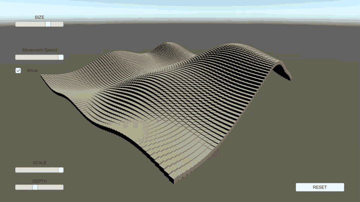

# Perlin Noise Visualiser

A small Unity toy that shows what Perlin noise looks like when you map it to the
heights of a grid of cubes. Every parameter is wired to a slider, so you can
reshape the terrain while it is running and watch the noise field scroll past.

## Running it

Built with **Unity 2019.3.9f1**. Open the project folder in Unity and play
`Assets/Scenes/SampleScene.unity`. Newer Unity versions will offer to upgrade
the project on first open, which is fine — the only script is
`Assets/GameManager.cs`.

---

Built in 2020 as a personal project while learning Unity. The source is
unchanged from then; the recording above was captured later to document it.
